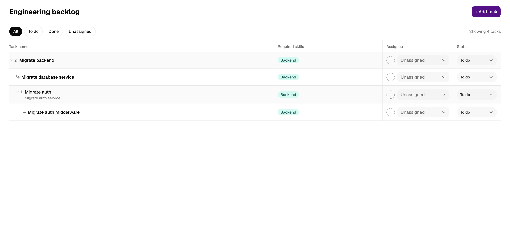

# frontend

This is a single-page application for managing an engineering backlog. It
shows every task and its nested subtasks as a filterable tree, opens a side
panel to view a task, assign it to a developer with the right skills, or mark
it done, and provides a form for creating a task together with its subtasks in
one go.

Built with Next.js 16 App Router, React 19, Tailwind 4, shadcn/ui, TanStack
Query, react-hook-form and nuqs.



## Running

The backend must be up (see the root README). Then, from the repo root:

```sh
bun dev:frontend        # next dev on :3000
```

Or from this directory: `bun run dev`, `bun run build`, `bun run start`,
`bun run lint`, `bun run typecheck`.

## Configuration

`frontend/.env.local` (copy from `.env.example`):

| Variable | Default | Purpose |
| --- | --- | --- |
| `NEXT_PUBLIC_API_URL` | `http://localhost:4000` | Backend base URL. Inlined at build time — changing it requires a rebuild. |

## What the page does

- **List** every task as a tree. Subtasks are collapsed under their parent
  and expand on click. A table at `md` and above, stacked cards below.
- **Filter** by status or "unassigned" via `?filter=`. The open task is
  `?task=<id>`, so any view can be linked or reloaded.
- **Change assignee or status inline.** Developers who lack a required skill
  are listed but disabled (the create form hides them instead). "Done" is
  withheld while a subtask is still open.
  Updates are optimistic and roll back with a toast if the server refuses.
- **Detail panel** shows the task, its parent, and its direct subtasks, each
  a link that opens that task in the same panel.
- **Create panel** builds a task with nested subtasks in one form. Required
  skills are optional at every level; a task sent without them has them
  inferred server-side, and the success toast names what was inferred. The
  assignee picker is disabled until skills are chosen.

## Structure

```
app/                App Router: layout, page, error boundary, providers
  _components/      components private to the page
  _hooks/           React Query mutations and nuqs URL state
components/ui/      shadcn/ui components
lib/                API client, query definitions, constants
types/              the API contract, hand-maintained; import from `@/types`
```

## Types

`types/` is a hand-maintained copy of the backend's API contract. There is no
shared package and no check that the two agree. When the Prisma schema
changes, update the matching file here and verify against a real response.

A future improvement is to generate these types from an API contract instead,
such as an OpenAPI spec published by the backend or a shared Zod/tRPC schema,
so the two sides cannot drift and the types no longer need hand maintenance.

## Reusable UI components using shadcn/ui

The UI is built on [shadcn/ui](https://ui.shadcn.com): accessible Radix primitives styled with Tailwind.
Components are copied into `components/ui/` and are editable. To add more
components to this directory:

```sh
bunx --bun shadcn@latest add <component>
```

## Dependencies and why

| Package | Why |
| --- | --- |
| `next` 16, `react` 19 | React framework with server components: the first paint is server-rendered with real data, the rest behaves as a normal SPA. |
| `@tanstack/react-query` | Server-state cache hydrated from the server prefetch; optimistic updates with rollback for the two mutations. |
| `react-hook-form` | Uncontrolled form state; `useFieldArray` makes the recursive subtask form cheap to render at any depth. |
| `nuqs` | Type-safe URL search-param state, so the active filter and the open task are shareable links. |
| `tailwindcss` 4, `radix-ui`, shadcn/ui (`class-variance-authority`, `cmdk`, `cn`, `lucide-react`, `tw-animate-css`) | Utility CSS plus accessible headless primitives; shadcn components are copied into `components/ui/` and owned by the repo. |
| `sonner` | Toasts for mutation results and errors. |

## Tests

```sh
bun test            # from this directory; or `bun run test` from the root
```

One pure suite, `app/_components/task-ui.test.ts`, covering the helpers that
turn the flat task list into a tree and mirror the server's rules
(`flattenTree`, `childrenOf`, `ancestorsOf`, `hasUnfinishedSubtasks`, skill
matching). No DOM, no network. Components are covered by `bun run lint` and
`bun run typecheck` only.
